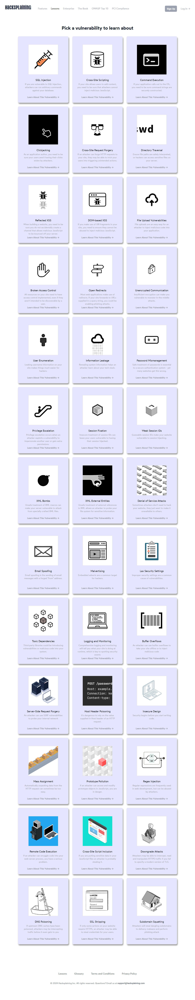

# Hacksplaining Web Application Security

### I recently completed all 39 lessons on Hacksplaining at https://www.hacksplaining.com/lessons, a security training website designed for web developers. 

#### These lessons cover every major security vulnerability that developers are likely to face. By reviewing the code samples that illustrate these vulnerabilities, combined with my knowledge of the OWASP Top 10, I gained a deeper understanding of the risks web applications face and learned how to effectively mitigate them to secure our web applications.

---

